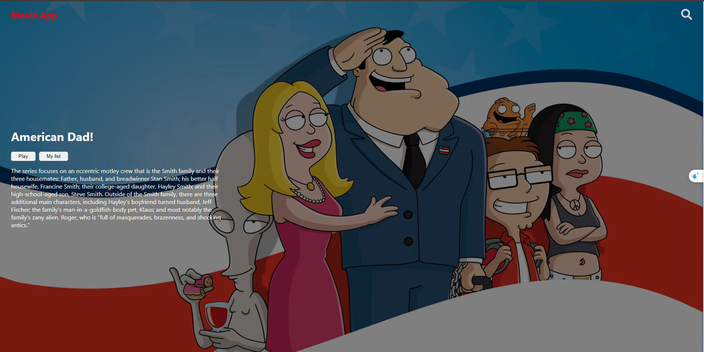
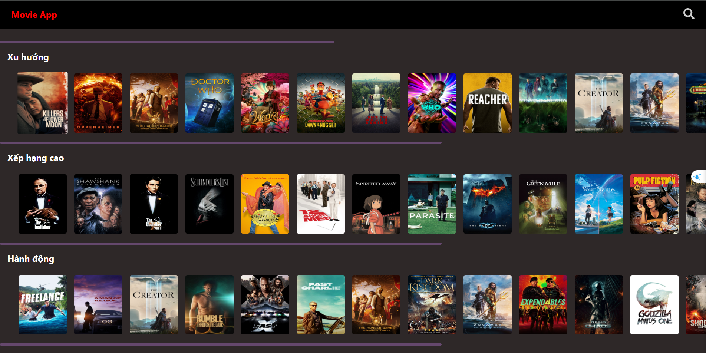
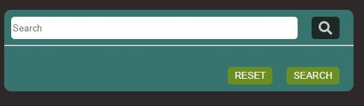

# React

#### This is a movie streaming website with various genres.

## Run Locally

Clone the project

```bash
  git clone https://github.com/chutrinh/movie-app-client.git
```

Go to the project directory

```bash
  cd movie-app-client

```

Install dependencies

```bash
  npm install
```

Start the server

```bash
  npm start
```

#### Banner movie



### genres



#### You can search for movies by name or by the genre you prefer.


